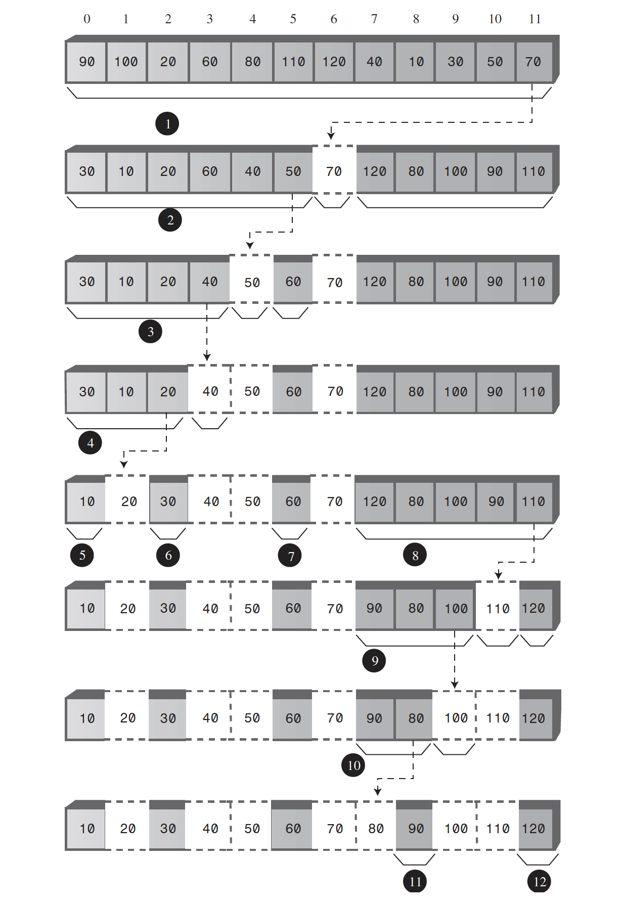

# Sorting algorithms
* [Bubble sort](#bubble-sort)
* [Selection sort](#selection-sort)
* [Insertion sort](#insertion-sort)
* [Merge sort](#merge-sort)
* [Shell sort](#shell-sort)
* [Quicksort](#quicksort)
* [Heapsort](#heapsort)
## Bubble sort
The idea is to put the smallest item at the beginning of the array (index 0) and the largest item at the end (index nElems-1). The loop counter _**out**_ in the outer for loop starts at the end of the array, at nElems-1, and decrements itself each time through the loop. The items at indices greater than _**out**_ are always completely sorted. The _**out**_ variable moves left after each pass by in so that items that are already sorted are no longer involved in the algorithm.
The inner loop counter _**in**_ starts at the beginning of the array and increments itself each cycle of the inner loop, exiting when it reaches _**out**_. Within the inner loop, the two array cells pointed to by _**in**_ and _**in+1**_ are compared, and swapped if the one in _**in**_ is larger than the one in _**in+1**_.
#### Invariant
In the bubble sort, the invariant is that the data items to the right of _**out**_ are sorted. This remains true throughout the running of the algorithm. (On the first pass, nothing has been sorted yet, and there are no items to the right of _**out**_ because it starts on the rightmost element.)
#### Efficiency of the Bubble Sort
In general, where N is the number of items in the array, there are N-1 comparisons on the first pass, N-2 on the second, and so on. The formula for the sum of such a series is

```(N–1) + (N–2) + (N–3) + ... + 1 = N*(N–1)/2```

Thus, the algorithm makes about N^2⁄2 comparisons (ignoring the –1, which doesn’t make much difference, especially if N is large).
There are fewer swaps than there are comparisons because two items are swapped only if they need to be. If the data is random, a swap is necessary about half the time, so there will be about N^2⁄4 swaps. (Although in the worst case, with the initial data inversely sorted, a swap is necessary with every comparison.)
Both swaps and comparisons are proportional to N^2. Because constants don’t count in **Big O** notation, we can ignore the 2 and the 4 and say that the bubble sort runs in **O(N^2)** time.
## Selection Sort
The selection sort improves on the bubble sort by reducing the number of swaps necessary from **O(N^2)** to **O(N)**. Unfortunately, the number of comparisons remains **O(N^2)**. However, the selection sort can still offer a significant improvement for large records that must be physically moved around in memory, causing the swap time to be much more important than the comparison time. (Typically, this isn’t the case in Java, where references are moved around, not entire objects.)

The outer loop, with loop variable _**out**_, starts at the beginning of the array (index 0) and proceeds toward higher indices. The inner loop, with loop variable _**in**_, begins at _**out**_ and likewise proceeds to the right. The __**min**__ variable starts at __**out**__. At each new position of _**in**_, the elements a[in] and a[min] are compared. If a[in] is smaller, then _**min**_ is given the value of _**in**_. At the end of the inner loop, _**min**_ points to the minimum value, and the array elements pointed to by _**out**_ and _**min**_ are swapped.
#### Invariant
In the selection sort, the data items with indices less than or equal to _**out**_ are always sorted.
#### Efficiency of the Selection Sort
The selection sort performs the same number of comparisons as the bubble sort: __N*(N-1)/2__. For 10 data items, this is 45 comparisons. However, 10 items require fewer than 10 swaps. With 100 items, 4,950 comparisons are required, but fewer than 100 swaps. For large values of N, the comparison times will dominate, so we would have to say that the selection sort runs in **O(N^2)** time, just as the bubble sort did. However, it is unquestionably faster because there are so few swaps. For smaller values of N, the selection sort may in fact be considerably faster, especially if the swap times are much larger than the comparison times.
## Insertion Sort
In most cases the insertion sort is the best of the elementary sorts. It still executes in **O(N^2)** time, but it’s about twice as fast as the bubble sort and somewhat faster than the selection sort in normal situations. It’s also not too complex, although it’s slightly more involved than the bubble and selection sorts. It’s often used as the final stage of more sophisticated sorts, such as quicksort.

In the outer for loop, _**out**_ starts at 1 and moves right. It marks the leftmost unsorted data. The __**temp**__ variable holds the value index with __**out**__. In the inner while loop, _**in**_ starts at _**out**_ and moves left, until either _**temp**_ is smaller than the array element there, or it can’t go left any further. Each pass through the while loop shifts another sorted element one space right.
#### Invariant
At the end of each pass, following the insertion of the item from _**temp**_, the data items with smaller indices than _**outer**_ are partially sorted.
#### Efficiency of the Insertion Sort
On the first pass, it compares a maximum of one item. On the second pass, it’s a maximum of two items, and so on, up to a maximum of N-1 comparisons on the last pass. This is

```1 + 2 + 3 + … + N-1 = N*(N-1)/2```

However, because on each pass an average of only half of the maximum number of items are actually compared before the insertion point is found, we can divide by 2, which gives __N*(N-1)/4__

The number of copies is approximately the same as the number of comparisons. However, a copy isn’t as time-consuming as a swap, so for random data this algorithm runs twice as fast as the bubble sort and faster than the selection sort. In any case, like the other simple sort routines, the insertion sort runs in __O(N2)__ time for random data.

For data that is already sorted or almost sorted, the insertion sort does much better. When data is in order, the condition in the while loop is never true, so it becomes a
simple statement in the outer loop, which executes N-1 times. In this case the algorithm runs in __O(N)__ time. If the data is almost sorted, insertion sort runs in almost __O(N)__ time, which makes it a simple and efficient way to order a file that is only slightly out of order.

However, for data arranged in inverse sorted order, every possible comparison and shift is carried out, so the insertion sort runs no faster than the bubble sort.
## Comparing the Simple Sorts
The bubble sort very simple but it’s practical only if the amount of data is small.

The selection sort minimizes the number of swaps, but the number of comparisons is still high. This sort might be useful when the amount of data is small and swapping data items is very time-consuming compared with comparing them.
  
The insertion sort is the most versatile of the three and is the best bet in most situations, assuming the amount of data is small or the data is almost sorted. For larger amounts of data, quicksort is generally considered the fastest approach.
  
We’ve compared the sorting algorithms in terms of speed. Another consideration for any algorithm is how much memory space it needs. All three of the algorithms in this chapter carry out their sort in place, meaning that, besides the initial array, very little extra memory is required. All the sorts require an extra variable to store an item temporarily while it’s being swapped.
## Merge sort
The idea in the mergesort is to divide an array in half, sort each half, and then merge the two halves into a single sorted array. You divide the half into two quarters, sort each of the quarters, and merge them to make a sorted half. Similarly, each pair of 8ths is merged to make a sorted quarter, each pair of 16ths is merged to make a sorted 8th, and so on. You divide the array again and again until you reach a subarray with only one element. This is the base case; it’s assumed an array with one element is already sorted. As mergeSort() returns from finding two arrays of one element each, it merges them into a sorted array of two elements. Each pair of resulting 2-element arrays is then merged into a 4-element array. This process continues with larger and larger arrays until the entire array is sorted.

The subarrays are stored in sections of the workspace array. This means that subarrays in the original array are copied to appropriate places in the workspace array. After each merge, the workspace array is copied back into the original array.
#### Efficiency of the mergesort
The mergesort runs in __O(N*logN)__ time. Let’s see how we can figure out the number of times a data item must be copied and the number times it must be compared with another data item during the course of the algorithm. We assume that copying and comparing are the most time-consuming operations.

To sort 8 items requires 3 levels, each of which involves 8 copies. A level means all copies into the same size subarray. In the first level, there are four 2-element subarrays; in the second level, there are two 4-element subarrays; and in the third level, there is one 8-element subarray. Each level has 8 elements, so again there are 3*8 or 24 copies (8*log(8) => 8*3 => 24).

Assuming the number of items is a power of 2, for each individual merging operation, the maximum number of comparisons is always one less than the number of items being merged, and the minimum is half the number of items being merged.
## Shell sort
The Shellsort is named for Donald L. Shell, the computer scientist who discovered it in 1959. It’s based on the insertion sort, but adds a new feature that dramatically improves the insertion sort’s performance. The Shellsort is good for medium-sized arrays, perhaps up to a few thousand items, depending on the particular implementation.

Here’s the problem with the insertion sort. Suppose a small item is on the far right, where the large items should be. To move this small item to its proper place on the left, all the intervening items (between the place where it is and where it should be) must be shifted one space right. This step takes close to N copies, just for one item. Not all the items must be moved a full N spaces, but the average item must be moved N/2 spaces, which takes N times N/2 shifts for a total of N2/2 copies. Thus, the performance of insertion sort is O(N2). This performance could be improved if we could somehow move a smaller item many spaces to the left without shifting all the intermediate items individually.

The Shellsort achieves these large shifts by insertion-sorting widely spaced elements. After they are sorted, it sorts somewhat less widely spaced elements, and so on. The spacing between elements for these sorts is called the increment and is traditionally represented by the letter h. This process continues until all the elements have been 4-sorted, which means that all items spaced four cells apart are sorted among themselves.

At the end of the 4-sort no item is more than two cells from where it would be if the array were completely sorted. This is what is meant by an array being “almost” sorted and is the secret of the Shellsort. The insertion sort is very efficient when operating on an array that’s almost sorted. If it needs to move items only one or two cells to sort the file, it can operate in almost O(N) time. Thus, after the array has been 4-sorted, we can 1-sort it using the ordinary insertion sort. The combination of the 4-sort and the 1-sort is much faster than simply applying the ordinary insertion sort without the preliminary 4-sort.

The sequence of numbers used to generate the intervals is called the interval sequence or gap sequence. The particular interval sequence shown here, attributed to Knuth, is a popular one. In reversed form, starting from 1, it’s generated by the recursive expression
```
h = 3*h + 1
```
#### Efficiency of the Shellsort
No one so far has been able to analyze the Shellsort’s efficiency theoretically, except in special cases. Based on experiments, there are various estimates like __N*(logN)^2__.
## Quicksort
In the majority of situations, it’s the fastest, operating in __O(N*logN)__ time. (This is only true for internal or in-memory sorting; for sorting data in disk files, other algorithms may be better.) Quicksort was discovered by C.A.R. Hoare in 1962.



Basically, the quicksort algorithm operates by partitioning an array into two subarrays and then calling itself recursively to quicksort each of these subarrays. However, there are some embellishments we can make to this basic scheme. They have to do with the selection of the pivot and the sorting of small partitions.

After the partition, if the pivot is inserted at the boundary between the left and right subarrays (this boundary is determined byt partition method), it will be in its final sorted position.

The worst situation results when a subarray with N elements is divided into one subarray with 1 element and the other with N-1 elements. Besides being slow, there’s another potential problem when quicksort operates in **O(N2)** time. When the number of partitions increases, the number of recursive function calls also increases. Every function call takes up room on the machine stack. If there are too many calls, the machine stack may overflow and paralyze the system.

A compromise solution is to find the median of the first, last, and middle elements of the array, and use this for the pivot. Those elements can be sorted and put in proper positions (first, center and last). Picking the median of the first, last, and middle elements is called the median-of-three approach. 

If you use the median-of-three partitioning method, it follows that the quicksort algorithm won’t work for partitions of three or fewer items. The number 3 in this case is called a cutoff point. Another option for dealing with small partitions is to use the insertion sort. When you do this, you aren’t restricted to a cutoff of 3. You can set the cutoff to 10, 20, or any other number. It’s interesting to experiment with different values of the cutoff to see where the best performance lies. Knuth recommends a cutoff of 9. However, the optimum number depends on your computer, operating system, compiler (or interpreter), and so on.
#### Efficiency of Quicksort
All divide-and-conquer algorithms operate in __O(N*logN)__ time in which a recursive method divides a range of items into two groups and then calls itself to handle each group. In this situation the logarithm actually has a base of 2.
## Heapsort
The basic idea is to insert all the unordered items into a heap using the normal insert() routine. Repeated application of the remove() routine will then remove the items in sorted order. Heapsort can be made to run faster by applying the trickle-down algorithm directly to N/2 items in the unsorted array, rather than inserting N items. The same array can be used for the initial unordered data, for the heap array, and for the final sorted data. Thus, heapsort requires no extra memory.
#### The Efficiency of Heapsort
Because insert() and remove() operate in **O(logN)** time, and each must be applied N times, the entire sort requires **O(N*logN)** time, which is the same as quicksort. However, it’s not quite as fast as quicksort, partly because there are more operations in the inner while loop in trickleDown() than in the inner loop in quicksort. Certain arrangements of key values can reduce quicksort to slow **O(N^2)** time, whereas heapsort runs in __O(N*logN)__ time no matter how the data is distributed.