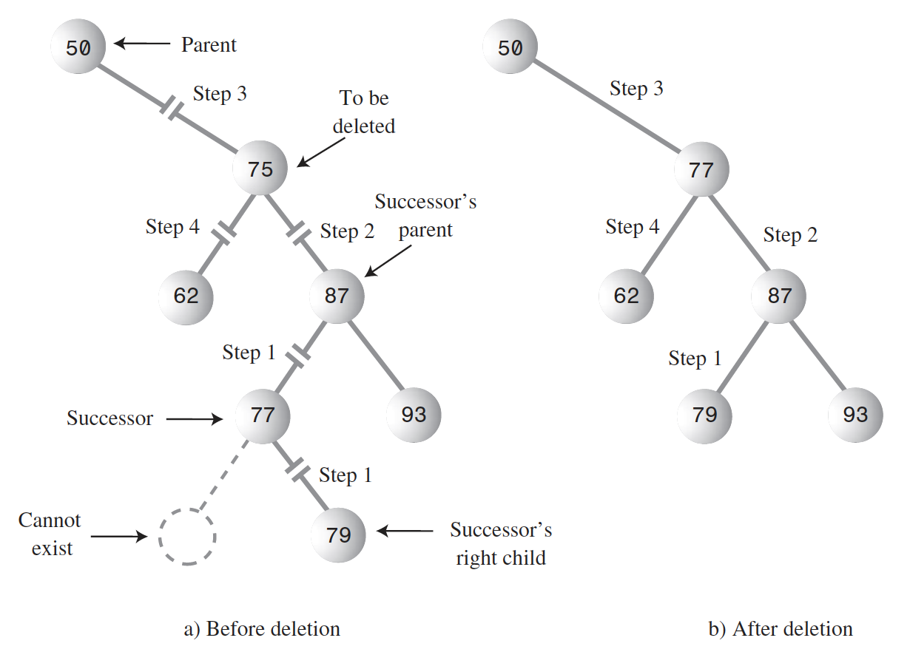

# Data structures
* [Arrays](#arrays)
* [Stacks](#stacks)
* [Queues](#queues)
* [Priority Queues](#priority-queues)
* [Linked Lists](#linked-lists)
* [Binary tree](#binary-tree)
## Arrays
* Predefined size;
* Ordered;
#### Insert
**O(1)** New element is always inserted in last available cell.

**O(N)** if the array is sorted, new item should be compared with already existing one to find a proper place where ti put it and existing items should be shiftem to make room for a new one.
#### Delete
**O(N)** You need first to find the item and after deletion shift all items coming after deleted one to fill the empty cell.

**O(N)** if the array is sorted to find an item will take O(logN) but it is still need to shift the remaining ones to fill the empty cell.
#### Search
**O(N)** In worst case you need to check all items.

**O(logN)** if the array is sorted we can use binary search.
## Stacks
* LIFO (Last-In-First-Out);
#### Push
**O(1)** New element is inserted int the top cell of the Stack.
#### Pop
**O(1)** The element is taken from the top cell of the Stack (and the element is deleted).
#### Peek
**O(1)** The same as Pop() but the element is not deleted.
## Queues
* FIFO (First-In-First-Out);
#### Add (Offer)
**O(1)** New element is inserted int the top cell of the Queue.
#### Remove (Poll)
**O(1)** The element is taken from the bottom cell of the Queue (and the element is deleted).
#### Element (Peek)
**O(1)** The same as Remove() but the element is not deleted.
#### Notes
1. To avoid the problem of not being able to insert more items into the queue even when it’s not full, the Front and Rear pointers wrap around to the beginning of the array. The result is a circular queue (sometimes called a ring buffer).
## Priority Queues
* FIFO (First-In-First-Out);
* Items are prioritized (sorted);
#### Add (Offer)
**O(N)** For new element to be inserted we need to compare it with other elements and if needed tshift them.
#### Remove (Poll)
**O(1)** The element is taken from the bottom cell of the Priority Queue (and the element is deleted).
#### Element (Peek)
**O(1)** The same as Remove() but the element is not deleted.
## Linked Lists
* The list itself consists of 2 parts, the list object and the inner container objects for the data;
* Each container object has a link to a next container object;
* The list object has a link to the first container object;
* The double-ended Linked List in the list object has links to the last and first elements. This kind of list allows to insert items in the begging and the end of the list;
* The doubly Linked List in each container object has the link to previous and next containers (right and left);

#### Add (addLast(), addFirst())
**O(1)** New item is inserted in the beginning (end) of the list. To do that only 2 links should be updated.
#### Add at index
**O(N)** To find the place for a new item you need to follow all the links to get to he needed index.
#### Element
**O(N)** To get the need item you need to follow the links from container to container to find it.
#### Delete
**O(1)** To delete an item form the beginning or the you just need to update 2 links.
## Binary tree
* There is only one root in a tree;
* There must be one (and only one!) path from the root to any other node;
* Every node in a tree can have at most two children;
* Left child should be less than parent;
* Right child should be greater or equal to the parent;
#### Find
**O(logN)** The time required to find a node depends on how many levels down it is situated.
#### Insert
**O(logN)** To insert a node means to find one that does not exist and update the references.
#### Traverse
**O(N)**
#### Delete
**O(logN)** To delete a node means to find the node and remove the references to it.
#### Notes on deleting a node
When you’ve found the node, there are three cases to consider:

**The node to be deleted is a leaf (has no children)** To delete a leaf node, you simply change the appropriate child field in the node’s parent to point to null, instead of to the node.

**The node to be deleted has one child** You want to “snip” the node out of this sequence by connecting its parent directly to its child. This process involves changing the appropriate reference in the parent (leftChild or rightChild) to point to the deleted node’s child.

**The node to be deleted has two children** To delete a node with two children, replace the node with its **inorder successor**. For each node, the node with the next-highest key is called its **inorder successor**, or simply its successor. If the right child of the original node has no left children, this right child is itself the successor.

To find a successor first, the program goes to the original node’s right child, which must have a key larger than the node. Then it goes to this right child’s left child (if it has one), and to this left child’s left child, and so on, following down the path of left children. The last left child in this path is the successor of the original node.

If **successor** is the right child of current, things are simplified somewhat because we can simply move the subtree of which successor is the root and plug it in where the deleted node was. This operation requires only two steps:
1. Unplug current from the rightChild field of its parent (or leftChild field if appropriate), and set this field to point to successor.
2. Unplug current’s left child from current, and plug it into the leftChild field of successor.

If **successor** is a left descendant of the right child of the node to be deleted, four steps are required to perform the deletion:
1. Plug the right child of successor into the leftChild field of the successor’s parent.
2. Plug the right child of the node to be deleted into the rightChild field of successor.
3. Unplug current from the rightChild field of its parent, and set this field to point to successor.
4. Unplug current’s left child from current, and plug it into the leftChild field of successor.

