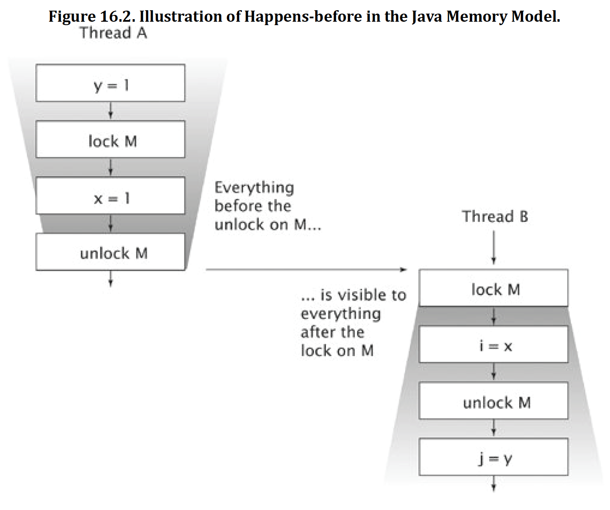

# Happens-before
The Java Memory Model is specified in terms of actions, which include reads and writes to variables, locks and unlocks of monitors, and starting and joining with threads. The JMM defines a partial ordering called happens-before on all actions within the program. To guarantee that the thread executing action B can see the results of action A (whether or not A and B occur in different threads), there must be a happens-before relationship between A and B. In the absence of a happens-before ordering between two operations, the JVM is free to reorder them as it pleases.

A data race occurs when a variable is read by more than one thread, and written by at least one thread, but the reads and writes are not ordered by happens-before. A correctly synchronized program is one with no data races; correctly synchronized programs exhibit sequential consistency, meaning that all actions within the program appear to happen in a fixed, global order.

The rules for happens-before are: 
* Program order rule. Each action in a thread happens-before every action in that thread that comes later in the program order. 
* Monitor lock rule. An unlock on a monitor lock happens-before every subsequent lock on that same monitor lock. 
* Volatile variable rule. A write to a volatile field happens-before every subsequent read of that same field. 
* Thread start rule. A call to Thread.start on a thread happens-before every action in the started thread. 
* Thread termination rule. Any action in a thread happens-before any other thread detects that thread has terminated, either by successfully return from Thread.join or by Thread.isAlive returning false. 
* Interruption rule. A thread calling interrupt on another thread happens-before the interrupted thread detects the interrupt (either by having InterruptedException thrown, or invoking isInterrupted or interrupted). 
* Finalizer rule. The end of a constructor for an object happens-before the start of the finalizer for that object. 
* Transitivity. If A happens-before B, and B happens-before C, then A happens-before C.

Even though actions are only partially ordered, synchronization actions - lock acquisition and release, and reads and writes of volatile variables - are totally ordered. This makes it sensible to describe happens-before in terms of "subsequent" lock acquisitions and reads of volatile variables. Figure 16.2 illustrates the happens-before relation when two threads synchronize using a common lock. All the actions within thread A are ordered by the program order rule, as are the actions within thread B. Because A releases lock M and B subsequently acquires M, all the actions in A before releasing the lock are therefore ordered before the actions in B after acquiring the lock. When two threads synchronize on different locks, we can't say anything about the ordering of actions between them - there is no happens-before relation between the actions in the two threads.

Other happens-before orderings guaranteed by the class library include: 
* Placing an item in a thread-safe collection happens-before another thread retrieves that item from the collection; 
* Counting down on a CountDownLatch happens-before a thread returns from await on that latch; 
* Releasing a permit to a Semaphore happens-before acquiring a permit from that same Semaphore; 
* Actions taken by the task represented by a Future happens-before another thread successfully returns from Future.get; 
* Submitting a Runnable or Callable to an Executor happens-before the task begins execution; and 
* A thread arriving at a CyclicBarrier or Exchanger happens-before the other threads are released from that same barrier or exchange point. If CyclicBarrier uses a barrier action, arriving at the barrier happens-before the barrier action, which in turn happens-before threads are released from the barrier. 