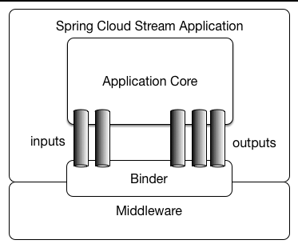

# Spring Cloud Stream

### Main Concepts and Abstractions


A Spring Cloud Stream application consists of a middleware-neutral core. The application communicates with the outside world by establishing **bindings** between destinations exposed by the external brokers and input/output arguments in your code. Broker specific details necessary to establish **bindings** are handled by middleware-specific **Binder** implementations.

Spring Cloud Stream provides **Binder** implementations for **Kafka** and **Rabbit MQ**. The framework also includes a test binder for integration testing of your applications as spring-cloud-stream application.

### Programming Model
To understand the programming model, you should be familiar with the following core concepts:
* **Destination Binders:** Components responsible to provide integration with the external messaging systems.
* **Bindings:** Bridge between the external messaging systems and application provided Producers and Consumers of messages (created by the Destination Binders).
* **Message:** The canonical data structure used by producers and consumers to communicate with Destination Binders (and thus other applications via external messaging systems).

#### Binding and Binding names
It defines a single bean of type Function and that is it. So, how does it become a spring-cloud-stream application? It becomes a spring-cloud-stream application simply because of the presence of spring-cloud-stream and binder dependencies and auto-configuration classes on the classpath, effectively setting the context for your boot application as a spring-cloud-stream application. And in this context beans of type Supplier, Function or Consumer are treated as defacto message handlers triggering binding of to destinations exposed by the provided binder following certain naming conventions and rules to avoid extra configuration.

Unlike the explicit naming required by annotation-based support (legacy) used in the previous versions of spring-cloud-stream, the functional programming model defaults to a simple convention when it comes to binding names, thus greatly simplifying application configuration. Let’s look at the first example:
```java
@SpringBootApplication
public class SampleApplication {

	@Bean
	public Function<String, String> uppercase() {
	    return value -> value.toUpperCase();
	}
}
```
In the preceding example we have an application with a single function which acts as message handler. As a **Function** it has an input and output. The naming convention used to name input and output bindings is as follows:

* **input** - \<functionName> + -in- + \<index>
* **output** - \<functionName> + -out- + \<index>

The in and out corresponds to the type of binding (such as input or output). The index is the index of the input or output binding. It is always 0 for typical single input/output function, so it’s only relevant for Functions with multiple input and output arguments.

So if for example you would want to map the input of this function to a remote destination (e.g., topic, queue etc) called "my-topic" you would do so with the following property:
```
spring.cloud.stream.bindings.uppercase-in-0.destination=my-topic
```
Note how **uppercase-in-0** is used as a segment in property name. The same goes for **uppercase-out-0**.

Sometimes to improve readability you may want to give your binding a more descriptive name (such as 'account', 'orders' etc). Another way of looking at it is you can map an implicit binding name to an explicit binding name. And you can do it with **spring.cloud.stream.function.bindings.<binding-name>** property.
```
spring.cloud.stream.function.bindings.uppercase-in-0=input
```
In the preceding example you mapped and effectively renamed **uppercase-in-0** binding name to **input**. Now all configuration properties can refer to **input** binding name instead (e.g., --spring.cloud.stream.bindings.input.destination=my-topic).

### Producing and Consuming Messages
Here is the example of the application exposing message handler as **java.util.function.Function** effectively supporting pass-thru semantics by acting as consumer and producer of data.
```java
@SpringBootApplication
public class MyFunctionBootApp {

	public static void main(String[] args) {
		SpringApplication.run(MyFunctionBootApp.class);
	}

	@Bean
	public Function<String, String> toUpperCase() {
		return s -> s.toUpperCase();
	}
}
```
In the preceding example, we define a bean of type **java.util.function.Function** called **toUpperCase** to be acting as message handler whose 'input' and 'output' must be bound to the external destinations exposed by the provided destination binder. By default the 'input' and 'output' binding names will be **toUpperCase-in-0** and **toUpperCase-out-0**.

Here is the example of a **source** semantics exposed as **java.util.function.Supplier**
```java
@SpringBootApplication
public static class SourceFromSupplier {

	@Bean
	public Supplier<Date> date() {
		return () -> new Date(12345L);
	}
}
```
Here is the example of a sink semantics exposed as java.util.function.Consumer
```java
@SpringBootApplication
public static class SinkFromConsumer {

	@Bean
	public Consumer<String> sink() {
		return System.out::println;
	}
}
```

To specify which functional bean to bind to the external destination(s) exposed by the bindings, you must provide **spring.cloud.function.definition** property.

### Links
https://docs.spring.io/spring-cloud-stream/reference/index.html