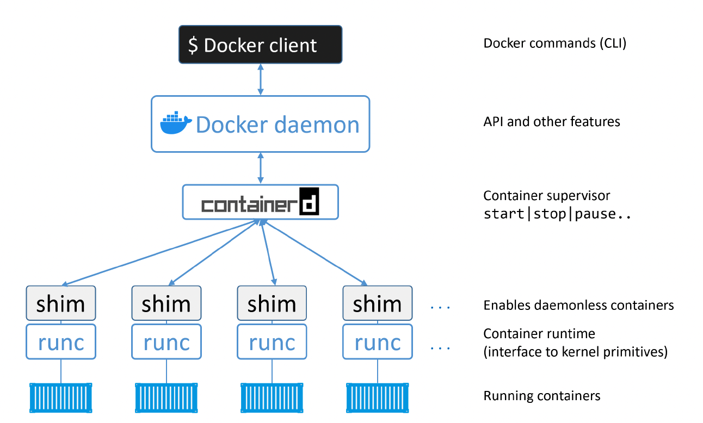

# Docker Components

* [runc](#runc)
* [containerd](#containerd)
* [shim](#shim)
* [Docker daemon](#docker-daemon)

### runc
runc is the reference implementation of the OCI (Open Container Initiative) container-runtime-spec. Docker, Inc. was heavily involved in defining the spec and developing runc. If you strip everything else away, runc is a small, lightweight CLI wrapper for libcontainer (libcontainer is the interface layer with the host OS).

### containerd
containerd was originally intended to be small, lightweight, and designed for a single task in life — container lifecycle operations. However, over time it has branched out and taken on more functionality. things like image pulls, volumes and networks. One of the reasons for adding more functionality is to make it easier to use in other projects. For example, in projects like Kubernetes, it was beneficial for containerd to do additional things like push and pull images. For these reasons, containerd now does a lot more than simple container lifecycle management. However, all the extra functionality is modular and optional, meaning you can pick and choose which bits you want. So, it’s possible to include containerd in projects such as Kubernetes, but only to take the pieces your project needs. containerd was developed by Docker, Inc. and donated to the Cloud Native Computing Foundation (CNCF). At the time of writing, containerd is a fully graduated CNCF project, meaning it’s stable and considered ready for production.

### shim
The shim is integral to the implementation of daemonless containers (what we just mentioned about decoupling running containers from the daemon for things like daemon upgrades).

We mentioned earlier that containerd uses runc to create new containers. In fact, it forks a new instance of runc for every container it creates. However, once each container is created, the parent runc process exits. This means we can run hundreds of containers without having to run hundreds of runc instances.

Once a container’s parent runc process exits, the associated containerd-shim process becomes the container’s parent. Some of the responsibilities the shim performs as a container’s parent include:
* Keeping any STDIN and STDOUT streams open so that when the daemon is restarted, the container doesn’t terminate due to pipes being closed etc.
* Reports the container’s exit status back to the daemon.

### Docker daemon
At the time of writing, some of the major functionality that still exists in the daemon includes; image management, image builds, the REST API, authentication, security, core networking, and orchestration.