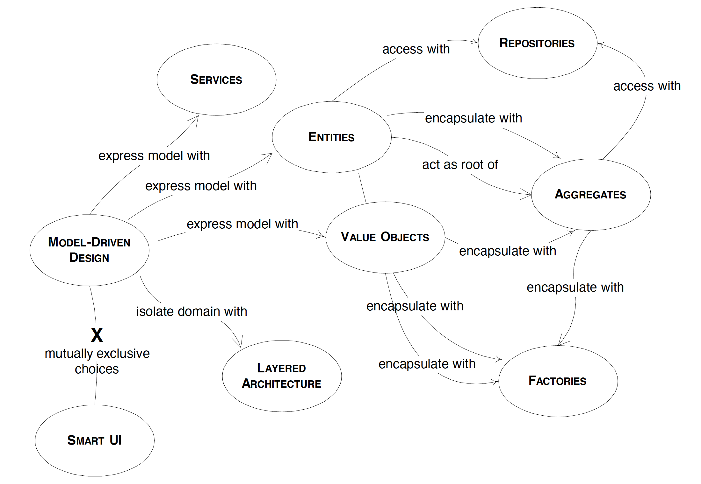

# The Building Blocks of Model-driven Design

* [LAYERED ARCHITECTURE](#layered-architecture)
* [Associations](#associations)
* [ENTITIES (AKA REFERENCE OBJECTS)](#entities-aka-reference-objects)
* [VALUE OBJECTS](#value-objects)
* [SERVICES](#services)
* [MODULES (AKA PACKAGES)](#modules-aka-packages)

#### LAYERED ARCHITECTURE
The essential principle is that an element of a LAYER has dependencies only on other elements in the same layer or on elements of the layers “beneath” it. Communication upward must be through some indirect mechanism.

The value of layers is that each specializes in a particular aspect of a computer program. This allows more cohesive designs of each aspect, and makes these designs much easier to interpret.

Name | Description
---- | -----------
User Interface (aka Presentation Layer) | Responsible for showing information to the user and interpreting the user’s commands. The external actor might sometimes be another computer system rather than a human user.
Application Layer | Defines the jobs the software is supposed to do and directs the expressive domain objects to work out problems. The tasks this layer is responsible for are meaningful to the business or necessary for interaction with the application layers of other systems. This layer is kept thin. It does not contain business rules or knowledge, but only coordinates tasks and delegates work to collaborations of domain objects in the next layer down. It does not have state reflecting the business situation, but it can have state that reflects the progress of a task for the user or the program.
Domain Layer (aka Model Layer) | Responsible for representing concepts of the business, information about the business situation, and business rules. State that reflects the business situation is controlled and used here, even though the technical details of storing it are delegated to the infrastructure. This layer is the heart of business software.
Infrastructure Layer | Provide generic technical capabilities that support the higher layers: message sending for the application, persistence for the domain, drawing widgets for the UI, etc. The infrastructure layer may also support the pattern of interactions between the four layers through an architectural framework.

In a MODEL-DRIVEN DESIGN, the software constructs of the domain layer will mirror the model concepts. It is not practical to achieve that correspondence when the domain logic is mixed with other concerns of the program. Isolating the domain implementation is a prerequisite for a domain-driven design.

#### Associations
There are at least three ways of making associations more tractable:
* Imposition of a traversal direction. When application requirements do not require traversal in both directions, adding a traversal direction reduces interdependence and simplifies the design;
* Addition of a qualifier, effectively reducing multiplicity;
* Elimination of non-essential associations;

#### ENTITIES (AKA REFERENCE OBJECTS)
Many objects are not fundamentally defined by their attributes, but by a thread of continuity and identity.

Some objects are not defined primarily by their attributes. They represent a thread of identity that runs through time and often across distinct representations. Sometimes such an object must be matched with another object even though attributes differ. An object must be distinguished from other objects even though they might have the same attributes. Mistaken identity can lead to data corruption.

An object defined primarily by its identity is called an “ENTITY”. ENTITIES have special modeling and design considerations. They have lifecycles that can radically change their form and content, while a thread of continuity must be maintained. Their identities must be defined so that they can be effectively tracked. Their class definitions, responsibilities, attributes and associations should revolve around who they are, rather than the particular attributes they carry. Even for **ENTITIES** that don’t transform so radically or have such complicated lifecycles, applying the semantic category leads to more lucid models and more robust implementations.

In a banking application, two deposits of the same amount to the same account on the same day are still distinct transactions, so they have identity and are ENTITIES. On the other hand, the amount attributes of those two transactions are probably instances of some money object. These values have no identity, since there is no usefulness in distinguishing them. In fact, some objects can have the same identity without having the same attributes, or even, necessarily, being of the same class.

ENTITIES are defined by their identities. Attributes are attached and change. Therefore, strip the ENTITY object’s definition down to the most intrinsic characteristics, particularly those that identify it, or are commonly used to find or match it. Separate other characteristics into other objects associated with the core ENTITY.

#### VALUE OBJECTS
Many objects have no conceptual identity. These objects describe some characteristic of a thing.

An object that represents a descriptive aspect of the domain that has no conceptual identity is called a VALUE OBJECT. VALUE OBJECTS are instantiated to represent elements of the design that we care about only for *what they are*, not *who they are*.

VALUE OBJECTS are often passed as parameters in messages between objects. They are frequently transient, created for an operation and then discarded. VALUE OBJECTS are used as attributes of ENTITIES (and other VALUES). A person may be modeled as an ENTITY with an identity, but that person’s name is a VALUE.

When you care only about the attributes of an element of the model, classify it as a VALUE OBJECT. Making it express the meaning of attributes it conveys and give it related functionality. Treat the VALUE OBJECT as immutable. Don’t give it any identity and avoid the design complexities necessary to maintain ENTITIES.

The attributes that make up a value object should form **a conceptual whole**. For example, street, city, and postal code shouldn’t be separate attributes of a Person object.

If two people have the same name, that does not make them the same person, or interchangeable. But the object representing the name is interchangeable since only the spelling of the name matters. A name object could be **copied** from the first person object to the second. In fact, the two person objects might not need their own name instances. The same name object could be **shared** between the two person objects (each with a pointer to the same name instance) with no change in their behavior or identity. That is, until some change is made to the name of one person. Then the other person’s name would change also! To protect from this, in order for an object to be safely shared, it must be **immutable**, meaning it cannot be changed except by full replacement.

#### SERVICES
The name “service” emphasizes the relationship with other objects. Unlike ENTITIES and VALUE OBJECTS, it is defined purely in terms of what it can do for a client. A SERVICE tends to be named for an activity, rather than an entity, a “verb” rather than a “noun”. A SERVICE can still have an abstract, intentional definition; it just has a different flavor than the definition of an object. A SERVICE should still have a defined responsibility, and that responsibility and the interface fulfilling it should be defined in terms of the domain language. Operation names should come from the UBIQUITOUS LANGUAGE or be introduced into it. Parameters and results should be domain objects.

A good SERVICE has three characteristics:
* The operation relates to a domain concept that is not a natural part of an ENTITY or VALUE OBJECT;
* The interface is defined in terms of other elements of the domain model;
* The operation is stateless;

#### MODULES (AKA PACKAGES)
There are technical considerations, but cognitive overload is the primary motivation for modularity. MODULES give people two views of the model. They can look at detail within a MODULE without being overwhelmed by the whole, or they can look at relationships between MODULES in views that exclude interior detail.

Whenever two model elements are separated into different modules, the relationships between them become less direct than they were, which increases the overhead of understanding their place in the design. **Low coupling** between MODULES minimizes this cost, and makes it possible to analyze the contents of one MODULE with a minimum of reference to others that interact.

The elements of a good model have synergy. Well-chosen MODULES bring together elements of the model with particularly rich conceptual relationships. This **high cohesion** of objects with related responsibilities allows modeling and design work to concentrate within a single MODULE, a scale of complexity a human mind can easily handle.

When choosing MODULES, focus on conceptual cohesion and telling the story of the system. If this results in tight coupling between MODULES, look to see if an overlooked concept would bring the elements together in a coherent MODULE, or if a change in model concepts would disentangle them. Seek low coupling in the sense of concepts that can be understood and reasoned about independently of each other. The MODULE should reflect insight into the domain. Refine the model until the concepts partition according to high-level domain concepts and the corresponding code is decoupled as well. Give the MODULES names that become part of the UBIQUITOUS LANGUAGE.