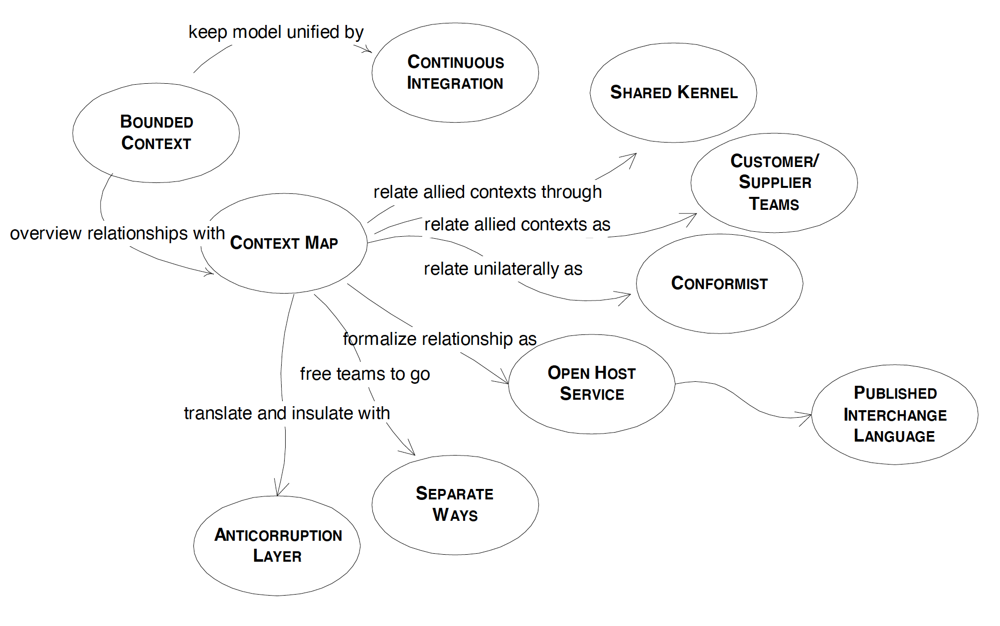
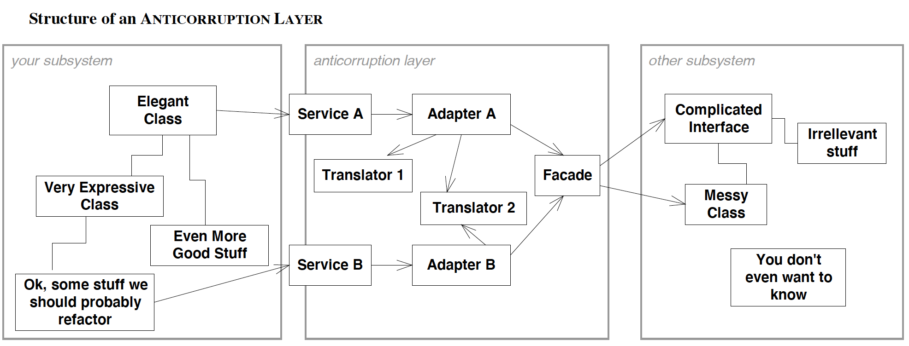

# Maintaining Model Integrity

* [BOUNDED CONTEXT](#bounded-context)
* [SHARED KERNEL](#shared-kernel)
* [ANTICORRUPTION LAYER](#anticorruption-layer)

#### BOUNDED CONTEXT
Multiple models are in play on any large project. Yet, when code based on distinct models is combined, software becomes buggy, unreliable, and difficult to understand. Communication among team members becomes confused. It is often unclear what context a model should not be applied in or where new work should be focused.

Explicitly define the context within which a model applies. Explicitly set boundaries in terms of team organization, usage within specific parts of the application, and physical manifestations such as code bases and database schemas. Keep the model strictly consistent within these bounds, but don’t be distracted or confused by issues outside.

A BOUNDED CONTEXT delimits the applicability of a particular model so that team members have a clear and shared understanding of what has to be consistent and how it relates to other contexts. Within that context, work to keep the model logically unified, but do not worry about applicability outside those bounds. In other contexts, other models apply, with differences in terminology, concepts and rules, and different dialects of the UBIQUITOUS LANGUAGE.

#### SHARED KERNEL
Designate some subset of the domain model that the two teams agree to share. Of course this includes, along with this subset of the model, the subset of code or of the database design associated with that part of the model. This explicitly shared stuff has special status, and shouldn’t be changed without consultation with the other team. Integrate a functional system frequently, but somewhat less than the pace of CONTINUOUS INTEGRATION within the teams. At these integrations, run the tests of both teams.

#### ANTICORRUPTION LAYER
Create an isolating layer to provide clients with functionality in terms of their own domain model. The layer talks to the other system through its existing interface, requiring little or no modification to the other system. Internally the layer translates in both directions as necessary between the two models.

One way of organizing the design of the ANTICORRUPTION LAYER is as a combination of FAÇADES, ADAPTERS, and translators, along with the communication and transport mechanisms usually needed to talk between systems.

